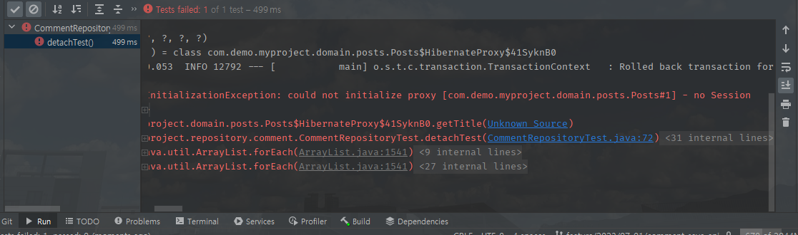

# proxy_no_session

### [org.hibernate.LazyInitializationException: could not initialize proxy [com.demo.myproject.domain.posts.Posts#1] - no Session]


해당 execption 같은 경우 jpa에서 필요할 때 조회해와서 프록시 또는 실제    
엔티티를 초기화하는데, 처음 getReference로 프록시를 가져온 후 detach로 비영속 상태     
를 만들게 되면 select조회 query가 나가지 않은상태로 준영속상태가 된다.   
그 후에 해당 프록시의 getter 메서드로 property를 가져오게 될 때 오류가 발생하는 것.      

코드는 다음과 같다.

```java

@Test
void detachTest() {
    Posts posts = new Posts("제목", "내용");
    Posts savedPosts = postsRepository.save(posts);

    em.flush();
    em.clear();

    Posts reference = em.getReference(Posts.class, posts.getId());
    System.out.println("reference.getClass() = " + reference.getClass());
//        System.out.println("reference = " + reference.getTitle());

    em.detach(reference);

    System.out.println(reference.getTitle());
    System.out.println(reference.getContent());
}
```
- em.getReference()를 통해 가져올 때는 proxy만 가져와서 실제 select쿼리가 나가지 않은 상태    
그 다음 property에 접근하지 않아, 객체 초기화가 되지 않은상태에서 detach   
- 다음으로 detach된 상태에서 proxy객체의 property에 접근.
- property에 접근하지만 값이 없어 프록시를 초기화해야 하는 상황
- 그러나 detach로 인해 하지 못하여 no Sesseion exception 발생